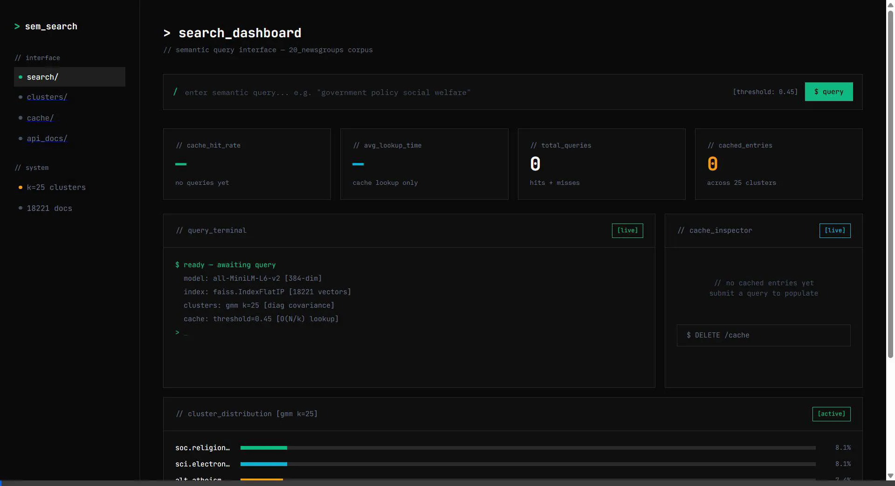

# Semantic Search & Caching System

A production-grade semantic search system built with FAISS, GMM fuzzy clustering, and a custom cluster-aware semantic cache, served via FastAPI.

Hosted demo: https://semantic-search-and-caching-system-production-9436.up.railway.app/

### Demo Video


## Architecture

| Component | Technology | Purpose |
|-----------|-----------|---------|
| **Embeddings** | `sentence-transformers/all-MiniLM-L6-v2` | 384-dim dense vectors for semantic representation |
| **Vector Store** | FAISS (`IndexFlatIP`) | In-memory similarity search with cosine similarity |
| **Clustering** | Gaussian Mixture Model (scikit-learn) | Soft/fuzzy cluster assignments with probability distributions |
| **Cache** | Custom Python (no Redis) | Cluster-aware semantic cache with O(N/k) lookup |
| **API** | FastAPI + Uvicorn | Async REST API with interactive dashboard |
| **Dataset** | 20 Newsgroups (~18,800 docs) | Classic text classification corpus |

## Quick Start

```bash
# 1. Create virtual environment
python -m venv venv
venv\Scripts\activate        # Windows
# source venv/bin/activate   # macOS/Linux

# 2. Install dependencies
pip install -r requirements.txt

# 3. Start the server
uvicorn main:app --host 127.0.0.1 --port 8000
```

The first startup will:
- Download the `all-MiniLM-L6-v2` model (~80MB)
- Download the 20 Newsgroups dataset
- Embed all documents (2-5 minutes on CPU)
- Train the GMM clustering model
- Launch the API server on http://127.0.0.1:8000

## Try It (6 Sample Cache Tests)

Use the dashboard and set the threshold to `0.45`.

For each pair:
- Run **Query A** first (expected **CACHE MISS**)
- Then run **Query B** (expected **CACHE HIT**)

### 1) Computers / OS troubleshooting
- Query A (MISS): `my windows pc is very slow after a recent update`
- Query B (HIT): `computer lagging since windows update how to fix`

### 2) Hardware / laptop power issues
- Query A (MISS): `laptop battery drains fast even when not using it`
- Query B (HIT): `battery losing charge quickly while idle on my notebook`

### 3) Autos / maintenance
- Query A (MISS): `what causes a car engine to misfire at idle`
- Query B (HIT): `engine runs rough and misfires when the car is stopped`

### 4) Religion / debate framing
- Query A (MISS): `is religion compatible with modern science`
- Query B (HIT): `can scientific thinking coexist with faith`

### 5) Politics / policy
- Query A (MISS): `should governments ban hate speech`
- Query B (HIT): `laws to restrict hateful speech by the state`

### 6) Science / space
- Query A (MISS): `why do astronauts experience weightlessness in orbit`
- Query B (HIT): `how microgravity happens on a spacecraft around earth`

## API Endpoints

### `POST /query`
```json
{
    "query": "government policy social welfare"
}
```
Response:
```json
{
    "query": "government policy social welfare",
    "cache_hit": false,
    "matched_query": null,
    "similarity_score": null,
    "result": { "text": "...", "score": 0.72, "category": "talk.politics.misc" },
    "dominant_cluster": 7,
    "cluster_info": { "dominant_cluster": 7, "max_probability": 0.85, "top_clusters": [...] }
}
```

### `GET /cache/stats`
```json
{
    "total_entries": 42,
    "hit_count": 17,
    "miss_count": 25,
    "hit_rate": 0.405
}
```

### `DELETE /cache`
Flushes the cache and resets all statistics.

## Docker

```bash
docker-compose up --build
```

## Design Decisions

### Why FAISS with IndexFlatIP?
Inner product on L2-normalized vectors equals cosine similarity. This avoids the overhead of separate normalization during search while maintaining exact similarity scores.

### Why GMM over K-Means?
K-Means forces hard cluster assignments. A document about "gun legislation" belongs to both politics and firearms with varying degrees. GMM's `predict_proba()` provides this probabilistic membership.

### Why custom cache instead of Redis?
The problem statement explicitly requires a cache built from first principles. Our cache uses GMM cluster structure to partition entries, reducing lookup from O(N) to O(N/k).

### Cache Threshold (0.45)
The threshold is intentionally tunable. With `all-MiniLM-L6-v2`, many valid paraphrases land in the `0.45–0.75` cosine similarity range.

- **0.90+**: Very strict. Mostly catches near-identical wording.
- **0.60–0.75**: Balanced for many paraphrases.
- **0.45** (default): High recall for paraphrases with different vocabulary.
